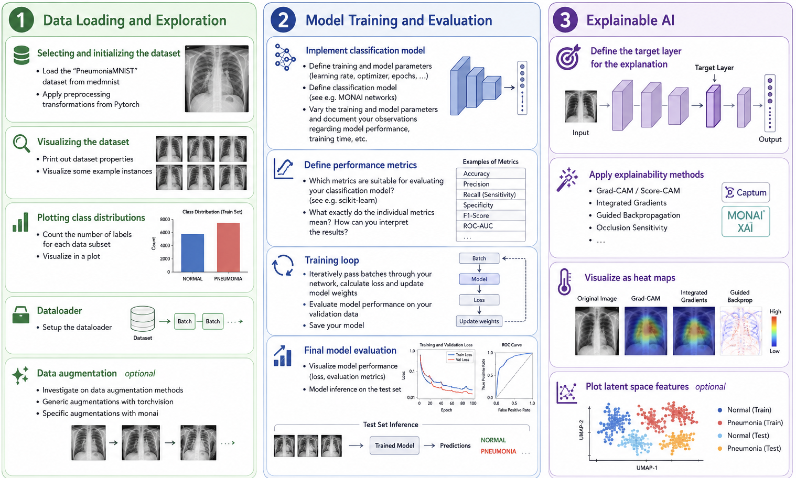

<p align="center">
  
</p>

# AI4Imaging Summer School 2026 — Hackathon

Hands-on notebooks for the **3rd AI4Imaging Summer School**, Vienna, 7–11 September 2026.

> Event page: <https://radiologie-nuklearmedizin.meduniwien.ac.at/ueber-uns/events/3-summer-school-al4imaging/>

Organised by the [Computational Imaging Research Lab (CIR)](https://www.cir.meduniwien.ac.at/),
Universtitätsklinik für Radiologie und Nuklearmedizin, and the Comprehensive
Center for Artificial Intelligence in Medicine, Medical University of Vienna.

---

## The two days

Each day has **its own notebook**. Work through the cells top to bottom — later
cells reuse datasets, models and helpers defined earlier. The markdown cells ask
questions on purpose; they are meant for discussion with your group.

### Day 1 — `day1_pneumonia_pipeline.ipynb`

A full deep-learning pipeline on **PneumoniaMNIST** ([MedMNIST](https://medmnist.com/)):
small, pre-packaged chest X-rays labelled *normal* / *pneumonia*, so you spend
your time on the ideas, not on data wrangling.

<p align="center">
  
</p>

1. **Data loading & exploration** — datasets, preprocessing, visualisation, class balance, `torchvision` / `MONAI` augmentation, a detour into multi-label ChestMNIST.
2. **Training** — build a ResNet with `MONAI`, choose loss / optimizer / learning rate, write the training loop, evaluate with AUC, accuracy, F1, sensitivity, specificity.
3. **Interpretation & explainability** — Grad-CAM & variants, saliency, guided backprop, latent-space views with PCA / t-SNE, and what "correct" interpretability means.
4. **Optional** — multi-label classification and open-ended extensions.

### Day 2 — `day2_skin_lesion_pipeline.ipynb`

A **real-world** dataset: dermatoscopic images from the
[ISIC Archive](https://www.isic-archive.com/), aggregated across many institutions
and devices — inconsistent metadata, duplicates, missing values and all.

1. **Curate** the raw images + `metadata.csv`: inspect, assess quality, clean,
   standardise, split, and export a documented dataset.
2. **Exercise I — Segmentation.** Train a lesion-segmentation model (U-Net,
   `segmentation_models_pytorch`, …). Target Dice > 80% on validation and test.
3. **Exercise II — VLM reporting.** Use an off-the-shelf medical
   Vision-Language Model to generate structured, clinical-style reports, and see
   how far prompt engineering alone (few-shot, chain-of-thought, structured
   output) can push report quality.

---

## Setup

Python 3.10+ recommended. From the repository root:

```bash
pip install --user -r requirements.txt
jupyter notebook
```

`requirements.txt` pulls in `medmnist`, `monai`, `torchvision`, `captum`,
`grad-cam`, `scikit-learn` and `matplotlib`. Keep NumPy < 2.0 — some imaging
libraries are not ready for 2.x.

## Credits

Datasets: [MedMNIST v2](https://medmnist.com/) (Yang et al.) and the
[ISIC Archive](https://www.isic-archive.com/). Explainability tooling from
[Captum](https://captum.ai/) and
[pytorch-grad-cam](https://github.com/jacobgil/pytorch-grad-cam).
Built for the AI4Imaging Summer School hackathon at the Medical
University of Vienna.
